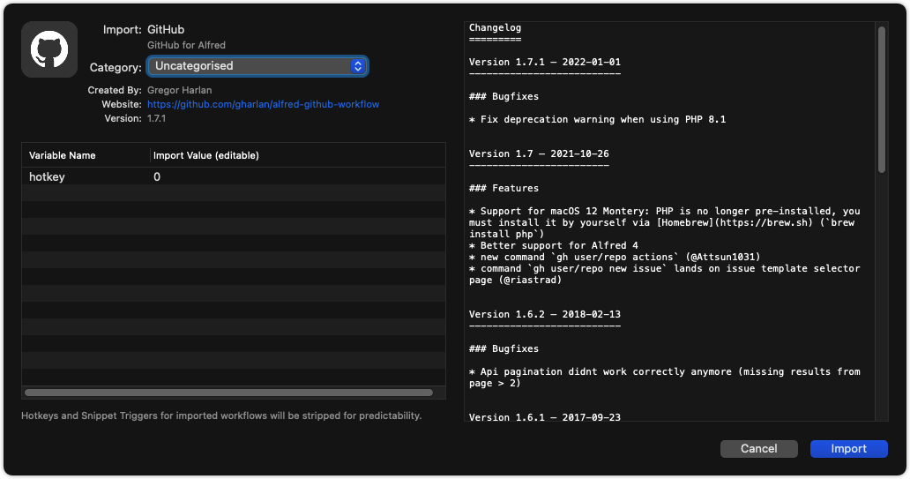

# Alfred 的 Workflow

Workflow 即工作流，wiki 百科解释：

    工作流（Workflow），是对工作流程及其各操作步骤之间业务规则的抽象、概括描述。 工作流建模，即将工作流程中的工作如何前后组织在一起的逻辑和规则，在计算机中以恰当的模型表達并对其实施计算。 工作流要解决的主要问题是：为实现某个业务目标，利用计算机在多个参与者之间按某种预定规则自动传递文档、信息或者任务。

笔者理解工作流即为对业务流程的抽象化，使业务过程的逻辑形成一定的节点之间连接而成的 “流”，通过层层链接而把业务描述成一定格式。

对于 Alfred 的 Workflow，我们也可以简单地理解其为某些通过脚本文件描述成流程的拓展功能，这些脚本可以用 `Shell`、`JavaScript`、`Ruby` 等等语言来写；当然，这节训练我们并不会教大家如何写一个 Workflow（三言两语也说不完），这里主要教大家如何导入别人的 Workflow 以及推荐一些好用的 Workflow。

## 导入与使用

拿 [`gharlan/alfred-github-workflow`](https://github.com/gharlan/alfred-github-workflow) 来举例，我们进入它的仓库，直接点击 Download 下载，可以发现下载了一个以 `.alfredworkflow` 结尾的文件，双击运行，即会弹出下图弹框：

其中左上区域是这个 Workflow 的一些信息，右边的区域是为它的脚本内容，可以看到它的脚本是用 PHP 写的。点击 `Import` 即可导入。

使用也很简单，比如该 Workflow 是提供了一个前缀 `gh`，激活 Alfred 后键入 `gh` + [空格] + [关键字]，即可在 github 搜索对应的内容，并且搜索结果会直接显示在 Alfred 预选列表（第一次使用需要 github 账号授权）；键入 `gh` + [空格] 则会显示自己账号的仓库内容。比如：

详细用法查看下载的 Workflow 的文档即可，不同的 Workflow 有不同的用法，不过一般大同小异。

## Workflow 推荐

- 有道翻译：https://github.com/whyliam/whyliam.workflows.youdao
- https://github.com/vitorgalvao/alfred-workflows#newpath-
- https://github.com/alexchantastic/alfred-open-with-vscode-workflow
- https://github.com/zenorocha/alfred-workflows#ip-address-v120--download
- https://github.com/jsumners/alfred-emoji